<picture>
  <source media="(prefers-color-scheme: dark)" srcset="assets/header-dark.svg">
  <source media="(prefers-color-scheme: light)" srcset="assets/header-light.svg">
  
</picture>

<p align="center">
  <a href="https://brian-bazurto.vercel.app"></a>
  <a href="https://linkedin.com/in/IBA001"></a>
  
  
</p>

---

## `SHEET 01` — Scope

CS student at **Florida International University** (Honors College, minor in Business Analytics), and founder of six student technical organizations across South Florida.

I build things that sit close to the tooling layer — AI coding agents, grammar-based fuzzers, evaluation harnesses — plus a lot of shipped product: language-learning apps, a LaTeX converter, a housing-affordability assistant, native Android and iOS apps.

The thread through all of it: **I'd rather find out my code is wrong from a fuzzer than from a user.**

```
FOCUS      ai coding agents · automated testing · developer tooling
BUILDING   habla365 · PaperTeX · Filebrew · Code Crunch Worldwide
LEARNING   evaluation environments, specification ambiguity, agent reasoning gaps
ASK ME     python, kotlin/swift, fuzzing, running a dev community that actually shows up
```

---

## `SHEET 02` — Telemetry

<p align="center">
<picture>
  <source media="(prefers-color-scheme: dark)" srcset="https://github-readme-stats-ba.vercel.app/api?username=ba-00001&show_icons=true&include_all_commits=true&count_private=true&rank_icon=percentile&border_radius=0&custom_title=FIG.%203%20%E2%80%94%20BUILD%20TELEMETRY&bg_color=071626&title_color=38bdf8&text_color=cfe9ff&icon_color=f0a500&border_color=27506f">
  <source media="(prefers-color-scheme: light)" srcset="https://github-readme-stats-ba.vercel.app/api?username=ba-00001&show_icons=true&include_all_commits=true&count_private=true&rank_icon=percentile&border_radius=0&custom_title=FIG.%203%20%E2%80%94%20BUILD%20TELEMETRY&bg_color=eef3f8&title_color=0369a1&text_color=123049&icon_color=b45309&border_color=a3bed4">
  
</picture>
<picture>
  <source media="(prefers-color-scheme: dark)" srcset="https://github-readme-streak-stats.herokuapp.com/?user=ba-00001&border_radius=0&background=071626&border=27506F&stroke=27506F&ring=38BDF8&fire=F0A500&currStreakNum=CFE9FF&sideNums=CFE9FF&currStreakLabel=38BDF8&sideLabels=5D829F&dates=5D829F">
  <source media="(prefers-color-scheme: light)" srcset="https://github-readme-streak-stats.herokuapp.com/?user=ba-00001&border_radius=0&background=EEF3F8&border=A3BED4&stroke=A3BED4&ring=0369A1&fire=B45309&currStreakNum=123049&sideNums=123049&currStreakLabel=0369A1&sideLabels=5B7893&dates=5B7893">
  
</picture>
</p>

<p align="center">
<picture>
  <source media="(prefers-color-scheme: dark)" srcset="https://github-readme-stats-ba.vercel.app/api/top-langs/?username=ba-00001&layout=compact&langs_count=9&count_private=true&size_weight=0.3&count_weight=0.7&hide=nushell%2Cfortran%2Cnix%2Ccython%2Croff%2Ctex%2Cmakefile%2Cshell%2Cbatchfile%2Cdockerfile&border_radius=0&custom_title=FIG.%204%20%E2%80%94%20MATERIAL%20DISTRIBUTION&bg_color=071626&title_color=38bdf8&text_color=cfe9ff&border_color=27506f">
  <source media="(prefers-color-scheme: light)" srcset="https://github-readme-stats-ba.vercel.app/api/top-langs/?username=ba-00001&layout=compact&langs_count=9&count_private=true&size_weight=0.3&count_weight=0.7&hide=nushell%2Cfortran%2Cnix%2Ccython%2Croff%2Ctex%2Cmakefile%2Cshell%2Cbatchfile%2Cdockerfile&border_radius=0&custom_title=FIG.%204%20%E2%80%94%20MATERIAL%20DISTRIBUTION&bg_color=eef3f8&title_color=0369a1&text_color=123049&border_color=a3bed4">
  
</picture>
</p>

<picture>
  <source media="(prefers-color-scheme: dark)" srcset="https://github-readme-activity-graph.vercel.app/graph?username=ba-00001&custom_title=FIG.%205%20%E2%80%94%20COMMIT%20ACTIVITY%20/%20LAST%2031%20DAYS&radius=0&bg_color=071626&color=cfe9ff&title_color=38bdf8&line=38bdf8&point=f0a500&area=true&area_color=38bdf8&border_color=27506f">
  <source media="(prefers-color-scheme: light)" srcset="https://github-readme-activity-graph.vercel.app/graph?username=ba-00001&custom_title=FIG.%205%20%E2%80%94%20COMMIT%20ACTIVITY%20/%20LAST%2031%20DAYS&radius=0&bg_color=eef3f8&color=123049&title_color=0369a1&line=0369a1&point=b45309&area=true&area_color=0369a1&border_color=a3bed4">
  
</picture>

<p align="center">
  <picture>
    <source media="(prefers-color-scheme: dark)" srcset="https://raw.githubusercontent.com/ba-00001/ba-00001/output/snake-dark.svg">
    <source media="(prefers-color-scheme: light)" srcset="https://raw.githubusercontent.com/ba-00001/ba-00001/output/snake-light.svg">
    
  </picture>
</p>

<details>
<summary><b>Supplementary sheets</b> — language split, commit rhythm, profile summary</summary>
<br>
<p align="center">
  
  
  
  
</p>
</details>

---

<picture>
  <source media="(prefers-color-scheme: dark)" srcset="assets/fig-build-loop-dark.svg">
  <source media="(prefers-color-scheme: light)" srcset="assets/fig-build-loop-light.svg">
  
</picture>

---

## `SHEET 03` — Selected work

| # | Project | What it is | Stack | Live |
|:--|:--|:--|:--|:--|
| 01 | **habla365** | Free 365-day language course, one short lesson a day — shipped in 10 languages off one framework | JS · Capacitor · Android/iOS | — |
| 02 | **PaperTeX** | LaTeX → PDF & Word across desktop, web and mobile, all sharing one converter backend | PySide6 · Flutter · TeXLive | [papertex-five](https://papertex-five.vercel.app) |
| 03 | **Filebrew** | Open-source local media converter — video, audio, image, nothing leaves your machine | Electron · ffmpeg | [repo](https://github.com/CODE-CRUNCH-LABS/Filebrew) |
| 04 | **Code Crunch Worldwide** | Website + curriculum hub for the org I founded | Static site · Vercel | [codecrunchglobal](https://codecrunchglobal.vercel.app) |
| 05 | **Code Crunch Tutor** | On-device voice language tutor — Whisper + WebLLM + Kokoro, entirely in-browser | Chrome ext · WebLLM | — |
| 06 | **ai-media** | Local, free brand-media generator (flyers, promo video, mascots) exposed over MCP / CLI / HTTP | Python · MCP | — |
| 07 | **Sturdy** | Housing-affordability assistant: affordable rent/buy estimates, grant matching, listing ranking | Flutter · Dart | — |
| 08 | **HootHacks** | Hackathon build — ranked entry, Flutter | Dart · Flutter | [repo](https://github.com/ba-00001/hoothacks) |

<details>
<summary><b>More public repos</b> — fuzzing, tooling, mobile coursework</summary>

- [`talentsignalstudio`](https://github.com/ba-00001/talentsignalstudio) — Python, hiring-signal analysis
- [`jobtracker`](https://github.com/ba-00001/jobtracker) — Python, application pipeline tracking
- [`neighborly`](https://github.com/ba-00001/neighborly) — Dart/Flutter, community app
- [`QuickBite`](https://github.com/ba-00001/QuickBite) — Python
- [`career-navigator-us-job-market`](https://github.com/ba-00001/career-navigator-us-job-market) — job-market analysis
- [`DEMOS-PROJECTS`](https://github.com/ba-00001/DEMOS-PROJECTS) — FlashGenius (AI flashcards), Pantry Tracker, EcoRoute, HealthWatch write-ups
- [`unit_test_calculator`](https://github.com/ba-00001/unit_test_calculator) — Python, test-first calculator
- Mobile: [`TUNE-TREK-APP-IOS`](https://github.com/ba-00001/TUNE-TREK-APP-IOS) · [`BITFIT_V2_ANDROID_APP`](https://github.com/ba-00001/BITFIT_V2_ANDROID_APP) · [`TASK_IOS_APP`](https://github.com/ba-00001/TASK_IOS_APP) · [`Tumbler_Detail_IOS_APP`](https://github.com/ba-00001/Tumbler_Detail_IOS_APP)

</details>

---

## `SHEET 04` — Bill of materials

<p align="center">
  <picture>
    <source media="(prefers-color-scheme: dark)" srcset="https://skillicons.dev/icons?i=py%2Cjava%2Ckotlin%2Cswift%2Cts%2Cjs%2Cdart%2Ccpp%2Cmysql&theme=dark">
    <source media="(prefers-color-scheme: light)" srcset="https://skillicons.dev/icons?i=py%2Cjava%2Ckotlin%2Cswift%2Cts%2Cjs%2Cdart%2Ccpp%2Cmysql&theme=light">
    
  </picture>
  <br>
  <picture>
    <source media="(prefers-color-scheme: dark)" srcset="https://skillicons.dev/icons?i=nextjs%2Creact%2Cflask%2Cfirebase%2Cflutter%2Cgcp%2Cvercel%2Candroidstudio%2Cgit&theme=dark">
    <source media="(prefers-color-scheme: light)" srcset="https://skillicons.dev/icons?i=nextjs%2Creact%2Cflask%2Cfirebase%2Cflutter%2Cgcp%2Cvercel%2Candroidstudio%2Cgit&theme=light">
    
  </picture>
</p>

```
LANGUAGES   python · java · kotlin · swift · typescript · javascript · dart · c++ · sql
MOBILE      android (kotlin) · ios (swift) · flutter · rest · json · async networking
BACKEND     flask · firebase/firestore · next.js · google cloud · vercel
TESTING     grammar-based fuzzing · automated test generation · edge-case discovery
AGENTS      claude code · mcp servers · prompt/eval workflows · local llm pipelines
```

---

## `SHEET 05` — Field notes

**President & Founder** — Aug 2024 → present · Miami, FL
Founded and run six student technical organizations, each with its own site and program:
[GDG at FIU](https://gdgatfiu.vercel.app) · [Swift Club at FIU](https://swiftclubatfiu.vercel.app) · [Code Crunch](https://codecrunchglobal.vercel.app) · [ColorStack at FIU](https://colorstackatfiu.vercel.app) · [CAHSI at FIU](https://cahsiatfiu.vercel.app) · [Raspberry Pi Code Crunch](https://raspberrypicodecrunch.vercel.app)
Workshops, interview prep, project-based learning, hackathons, and industry panels with engineers from Google, ServiceNow and Salesforce.

**Tech Fellow** — CodePath · Sep 2023 → present
Teach data structures, algorithms, debugging strategy and structured problem-solving. Best training I've had in explaining a hard idea to someone who hasn't seen it yet.

**SEO Tech Developer Intern** — May → Aug 2024 · New York, NY
Built AI-integrated applications end to end: AI Customer Support, EcoRoute, HealthWatch, StockSnap. Python backends, API-driven architectures.

---

## `SHEET 06` — Specifications

| Field | Value |
|:--|:--|
| Institution | Florida International University — Honors College |
| Degree | B.A. Computer Science, minor Business Analytics |
| Exchange | Google Tech Exchange — applied data structures, software development studio, careers in tech, project management |
| Certifications | CodePath — Android Dev, iOS Dev, Software Engineering, Cybersecurity |
| Honors | Dean's List · Hispanic Scholarship Fund Scholar · Tau Sigma National Honor Society · Phi Theta Kappa |

---

## `SHEET 07` — Contact

<p align="center">
  <a href="https://brian-bazurto.vercel.app"></a>
  <a href="https://linkedin.com/in/IBA001"></a>
  <a href="https://github.com/ba-00001?tab=repositories"></a>
</p>

<picture>
  <source media="(prefers-color-scheme: dark)" srcset="assets/footer-dark.svg">
  <source media="(prefers-color-scheme: light)" srcset="assets/footer-light.svg">
  
</picture>

<!--
Sheet art is generated, not hand-edited: assets/src/build.py emits every
assets/*.svg in both colour schemes. Edit the script, run `python3
assets/src/build.py`, commit the regenerated SVGs. CI does the same on push.
-->
